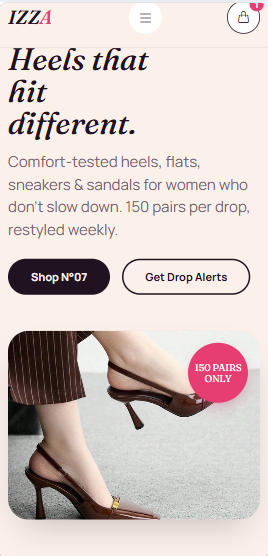
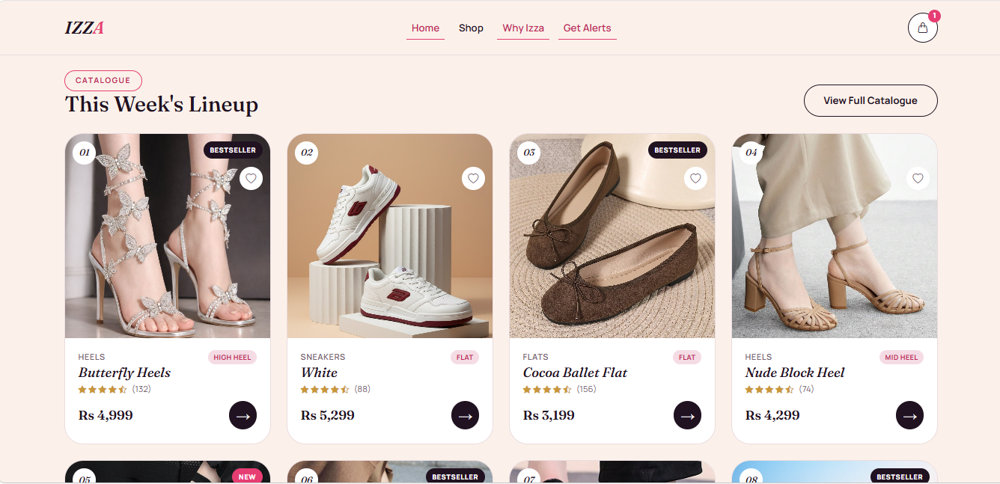
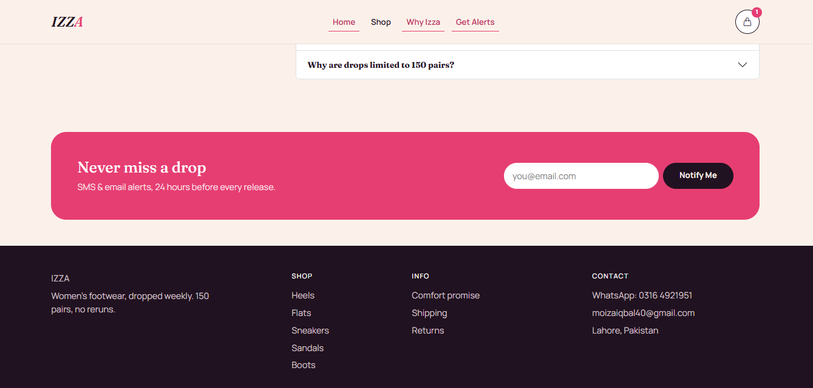

<h1 align="center">IZZA — Women's Footwear Store</h1>
<p align="center">
  A modern women's footwear e-commerce website built with PHP, MySQL, HTML, CSS & JavaScript.
</p>

## ✨ Features

* Browse footwear by category
* Search, filter, and sort products
* Quick product preview
* Wishlist functionality
* Shopping bag with saved items
* Responsive design for different screen sizes

## 🛠️ Tech Stack

* **HTML5** — structure
* **CSS3** — styling and responsive layout
* **JavaScript (ES6)** — interactions and application logic
* **Bootstrap 5.3** — responsive components and layout
* **Bootstrap Icons** — interface icons
* **localStorage** — wishlist and shopping bag persistence

## 📁 Project Structure

```text
ShoesByIzza/
├── index.html
├── shop.html
├── product.html
├── cart.html
├── style.css
├── script.js
├── home.png
├── heels.png
├── store.png
├── mobile.png
└── images/
```

## 🚀 How to Run

1. Clone the repository:

```bash
git clone https://github.com/moizaiqbal40-ops/ShoesByIzza.git
```

2. Open the project folder:

```bash
cd ShoesByIzza
```

3. Open `index.html` in your browser.

No installation or build process is required.

## 📸 Screenshots

<p align="center">
  
  
</p>

<p align="center">
  
  
</p>

> Good design should make the experience feel simple.
